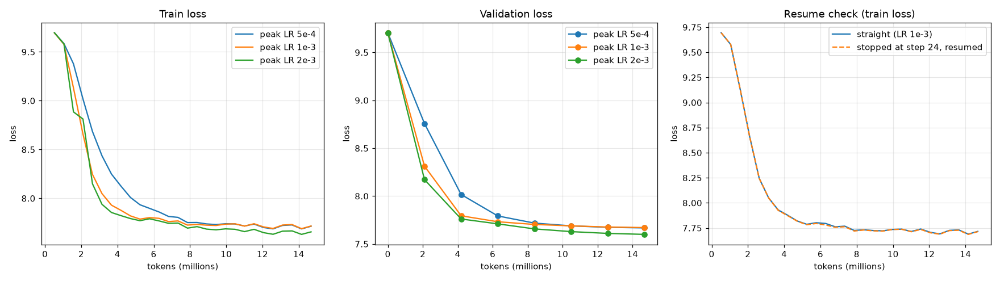

# Phase 4 results: pretraining pilot

Generated on 2026-09-24 by `scripts/pilot_report.py` from the pilot runs; do not edit by hand. Decision: D-028 in [DECISIONS.md](../DECISIONS.md).

Each pilot trains the chosen 62.1M model (D-026) on ~1% of the full run's tokens (14.9M), with the full run's settings and the schedule compressed to the pilot's length (warmup 6 steps, cosine decay to 10% of the peak).

| Peak LR | Final val loss | Largest train-loss rise after warmup | Max grad norm |
|---|---:|---:|---:|
| 5e-4 | 7.668 | +0.035 | 1.85 |
| 1e-3 | 7.671 | +0.035 | 6.84 |
| 2e-3 | 7.600 | +0.032 | 10.36 |

**Rule (fixed before the runs, `configs/pretrain/pilot_report.yaml`):** among the learning rates whose train loss never rises by more than 0.5 after warmup, take the lowest one whose final validation loss is within 0.02 of the best. **Chosen: 2e-3.**

**Resume check:** the run stopped at step 24 and resumed from its checkpoint; over the 28 steps logged by both, its train loss differs from the straight run's by at most 0.015 (GPU kernels are not bit-exact; on the CPU the resume test is bit-identical).

**Speed:** 86,113 tokens/s (median, torch.compile). The full run (5,675 steps) would take about 4.8 h plus evaluations and checkpoints.
