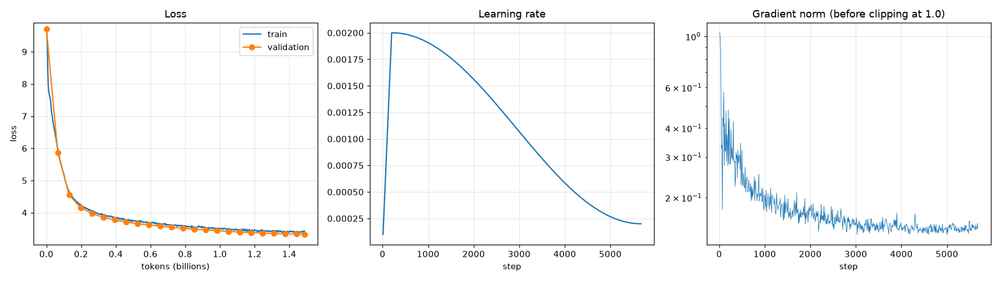

# Phase 4 results: pretraining

Generated on 2026-09-24 by `scripts/pretrain_report.py`; do not edit by hand. Setup: D-028 in [DECISIONS.md](../DECISIONS.md).

5,675 steps, 1.488B tokens. Final validation loss **3.330** (perplexity 27.9), from 9.705 at step 0. Median speed 87,322 tokens/s.

Validation loss per source (up to 200 held-out documents each, first 1,024 tokens of each), with each source's share of the train and validation tokens:

| Source | Documents | Tokens | Loss | Perplexity | Share of train | Share of val |
|---|---:|---:|---:|---:|---:|---:|
| bitext-telco | 119 | 16,005 | 0.798 | 2.2 | 0.22% | 0.21% |
| bitext-banking | 135 | 28,288 | 1.253 | 3.5 | 0.36% | 0.37% |
| bitext-support | 127 | 17,586 | 1.474 | 4.4 | 0.26% | 0.23% |
| wikipedia-ar | 200 | 55,546 | 2.485 | 12.0 | 6.72% | 7.00% |
| wikipedia-en | 200 | 104,701 | 2.807 | 16.6 | 3.35% | 3.26% |
| fineweb-edu | 200 | 139,260 | 3.118 | 22.6 | 32.14% | 35.45% |
| fineweb2-arb | 200 | 107,067 | 3.413 | 30.4 | 36.84% | 37.10% |
| fineweb2-ars | 200 | 100,370 | 4.083 | 59.4 | 20.10% | 16.37% |
| clinc-train | 68 | 747 | 5.300 | 200.4 | 0.01% | 0.01% |
| massive-ar-train | 51 | 500 | 5.724 | 306.1 | 0.01% | 0.01% |

Train vs validation: each point of the train curve is measured on a batch before the model learns from it, so both curves are losses on text the model has not seen yet. The final model scores **3.398** on 640 train windows of 1,024 tokens (the first ones in the run's seeded order, so a random sample that it trained on in its first steps) and **3.330** on the run's 640 validation windows.

Sample continuations (temperature 0.8, 40 tokens, seed 42). This is a base model: it continues text, it does not answer yet.

| Prompt | Continuation |
|---|---|
| مرحبا، ابغي اعرف ليش |  الدوام ردي على كذا، رسالة فيها امتحان او جواب، شكو ما تكتب في مكان ثاني، دلني عليها، او او او او، انا ما قضيت يوم، روم |
| تعتبر مدينة دبي من |  المدن الكبرى التي افسدتها المجمعات التجارية الداخلية والخارجية وتوجد في المنطقة العديد من المشروعات التجارية الأخرى غير المأهولة, ويمكن الموقع من الاستفادة من خدمات قروض المشاريع التي لا تخدم فئة |
| The best way to learn a new language is |  to practice simple literal expressions before beginning it. Before beginning a literal English tutor, you can practice proof that the English tutor is not in love with an English or Roman |
| shlonak, abi a3ref |  id id makocyan Amer gatlama a 1mg khukr, 1mg khukr id ? a 1m |
| Customer: my card is not working at the ATM. ⏎ Agent: |  what is the identity and my personal information? I am unable to access this information. We can help you find the contact information you need. Please feel free to reach out to me for further assistance. |
