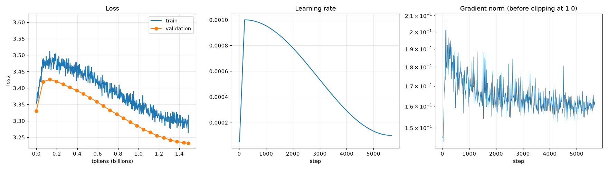

# Phase 4 results: second pretraining pass

Generated on 2026-09-25 by `scripts/pretrain_report.py`; do not edit by hand. Setup: D-031 in [DECISIONS.md](../DECISIONS.md).

5,675 steps, 1.488B tokens. Final validation loss **3.232** (perplexity 25.3), from 3.330 at step 0. Median speed 87,708 tokens/s.

Validation loss per source (up to 200 held-out documents each, first 1,024 tokens of each), with each source's share of the train and validation tokens:

| Source | Documents | Tokens | Loss | Perplexity | Share of train | Share of val |
|---|---:|---:|---:|---:|---:|---:|
| bitext-telco | 119 | 16,005 | 0.691 | 2.0 | 0.22% | 0.21% |
| bitext-banking | 135 | 28,288 | 1.141 | 3.1 | 0.36% | 0.37% |
| bitext-support | 127 | 17,586 | 1.365 | 3.9 | 0.26% | 0.23% |
| wikipedia-ar | 200 | 55,546 | 2.394 | 11.0 | 6.72% | 7.00% |
| wikipedia-en | 200 | 104,701 | 2.706 | 15.0 | 3.35% | 3.26% |
| fineweb-edu | 200 | 139,260 | 3.027 | 20.6 | 32.14% | 35.45% |
| fineweb2-arb | 200 | 107,067 | 3.307 | 27.3 | 36.84% | 37.10% |
| fineweb2-ars | 200 | 100,370 | 3.972 | 53.1 | 20.10% | 16.37% |
| clinc-train | 68 | 747 | 5.201 | 181.5 | 0.01% | 0.01% |
| massive-ar-train | 51 | 500 | 5.682 | 293.6 | 0.01% | 0.01% |

Train vs validation: each point of the train curve is measured on a batch before the model learns from it, so both curves are losses on text the model has not seen yet. The final model scores **3.315** on 640 train windows of 1,024 tokens (the first ones in the run's seeded order, so a random sample that it trained on in its first steps) and **3.231** on the run's 640 validation windows.

Sample continuations (temperature 0.8, 40 tokens, seed 42). This is a base model: it continues text, it does not answer yet.

| Prompt | Continuation |
|---|---|
| مرحبا، ابغي اعرف ليش |  الدوام رافع خشومكم..بس وين نودي جارنا؟ الله يخليكم ياجماعه.. فارق قلبي 11-08-2010, 12:31 AM روم |
| تعتبر مدينة دبي من |  أهم المدن السياحية في دولة الإمارات العربية المتحدة، حيث تضم المدينة العديد من الأماكن الترفيهية التي تجعلها من أفضل الوجهات العالمية. الموقع تقع مدينة دبي في قارة أمريكا الجنوبية، وتضم المدينة |
| The best way to learn a new language is |  to practice simple literal expressions before beginning it. Before beginning a literal English tense, begin to elaborate on the basic basic literal form. Ask students to practice mentals |
| shlonak, abi a3ref |  id id makt ei Amerihat il a3ref id makt ei Amerihat id id makt iu A |
| Customer: my card is not working at the ATM. ⏎ Agent: |  what is the identity of my friend? Your immediate concern is, your third party must answer your questions. Your safety is important. Your choice to participate in the entire program might be of surprise |
