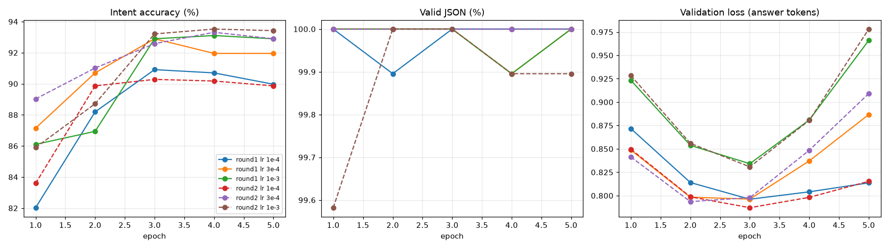

# Phase 5 results: supervised fine-tuning

Generated on 2026-09-25 by `scripts/sft_report.py`; do not edit by hand. Setup: D-029 and D-031 in [DECISIONS.md](../DECISIONS.md). All numbers are on the SFT validation split (synthetic, written by the same teacher as the training data); the human test set is scored only in Phase 6.

## Data

- Reply check (Qwen as proofreader): the 500-reply sample estimated 3.8% broken replies, above the 3% bar, so every reply was judged: 721 of the training and 42 of the validation replies were marked broken. Of the known-broken canary replies, the judge caught 0 of 2 in the sample check and 1 of 2 in the full check, so some broken replies remain.
- Broken replies rewritten and accepted: 679; dropped: 84.
- Top-up examples added to training: 3,066 (dropped: judge disagreed 512, broken reply 110, duplicate 4, near copy of a validation message 0).
- Final data: 20,572 training and 957 validation examples.

## Sweep and selection

| Round | Peak LR | Epoch | Val loss | Valid JSON | Intent acc. | Macro-F1 | Reply language | Intent by likelihood |
|---|---|---:|---:|---:|---:|---:|---:|---:|
| round1 | 1e-4 | 1 | 0.872 | 100.0% | 82.0% | 81.2% | 99.9% | 81.9% |
| round1 | 1e-4 | 2 | 0.814 | 99.9% | 88.2% | 87.6% | 99.9% | 88.3% |
| round1 | 1e-4 | 3 | 0.796 | 100.0% | 90.9% | 90.4% | 100.0% | 90.9% |
| round1 | 1e-4 | 4 | 0.804 | 100.0% | 90.7% | 90.2% | 100.0% | 90.7% |
| round1 | 1e-4 | 5 | 0.814 | 100.0% | 90.0% | 89.5% | 100.0% | 90.4% |
| round1 | 3e-4 | 1 | 0.849 | 100.0% | 87.1% | 86.9% | 99.9% | 87.1% |
| round1 | 3e-4 | 2 | 0.798 | 100.0% | 90.7% | 90.1% | 100.0% | 90.8% |
| round1 | 3e-4 | 3 | 0.796 | 100.0% | 92.9% | 92.5% | 100.0% | 92.8% |
| round1 | 3e-4 | 4 | 0.837 | 99.9% | 92.0% | 91.6% | 99.8% | 92.0% |
| round1 | 3e-4 | 5 | 0.887 | 100.0% | 92.0% | 91.6% | 99.7% | 91.8% |
| round1 | 1e-3 | 1 | 0.923 | 100.0% | 86.1% | 85.6% | 100.0% | 85.9% |
| round1 | 1e-3 | 2 | 0.854 | 100.0% | 86.9% | 85.8% | 100.0% | 86.9% |
| round1 | 1e-3 | 3 | 0.834 | 100.0% | 92.9% | 92.5% | 100.0% | 93.0% |
| round1 | 1e-3 | 4 | 0.881 | 99.9% | 93.1% | 92.9% | 99.6% | 93.0% |
| round1 | 1e-3 | 5 | 0.966 | 100.0% | 92.9% | 92.6% | 99.6% | 92.9% |
| round2 | 1e-4 | 1 | 0.850 | 100.0% | 83.6% | 82.9% | 99.9% | 83.5% |
| round2 | 1e-4 | 2 | 0.799 | 100.0% | 89.9% | 89.1% | 100.0% | 89.9% |
| round2 | 1e-4 | 3 | 0.787 | 100.0% | 90.3% | 89.6% | 100.0% | 90.3% |
| round2 | 1e-4 | 4 | 0.798 | 100.0% | 90.2% | 89.5% | 99.9% | 90.2% |
| round2 | 1e-4 | 5 | 0.815 | 100.0% | 89.9% | 89.2% | 99.6% | 90.3% |
| round2 | 3e-4 | 1 | 0.841 | 100.0% | 89.0% | 88.4% | 100.0% | 89.1% |
| round2 | 3e-4 | 2 | 0.794 | 100.0% | 91.0% | 90.3% | 100.0% | 91.1% |
| round2 | 3e-4 | 3 | 0.798 | 100.0% | 92.6% | 92.0% | 100.0% | 92.7% |
| round2 | 3e-4 | 4 | 0.849 | 100.0% | 93.3% | 93.0% | 99.8% | 93.2% |
| round2 | 3e-4 | 5 | 0.909 | 100.0% | 92.9% | 92.4% | 99.6% | 92.9% |
| round2 | 1e-3 | 1 | 0.928 | 99.6% | 85.9% | 85.6% | 99.5% | 86.0% |
| round2 | 1e-3 | 2 | 0.856 | 100.0% | 88.7% | 88.0% | 99.8% | 88.7% |
| round2 | 1e-3 | 3 | 0.831 | 100.0% | 93.2% | 92.8% | 99.8% | 93.2% |
| round2 | 1e-3 | 4 | 0.881 | 99.9% | 93.5% | 93.3% | 99.8% | 93.6% |
| round2 | 1e-3 | 5 | 0.978 | 99.9% | 93.4% | 93.2% | 99.5% | 93.5% |

- round1 winner (D-029 rule): lr 3e-4, epoch 3, intent accuracy 92.9%, valid JSON 100.0%.
- round2 winner (D-029 rule): lr 3e-4, epoch 3, intent accuracy 92.6%, valid JSON 100.0%.
- The round winners: round1 92.9% intent accuracy, 100.0% valid JSON, val loss 0.796; round2 92.6% intent accuracy, 100.0% valid JSON, val loss 0.798. Within 1.0 points they count as tied, so valid JSON and then validation loss decide.
- **Chosen:** round1, lr 3e-4, epoch 3 (`artifacts/checkpoints/sft-r1-lr3e-4/epoch_3.pt`).

## The chosen model on the validation split

Valid JSON 100.0% (parses: 100.0%, unfinished answers: 0.0%); intent accuracy 92.9%, macro-F1 92.5%; reply in an allowed language 100.0%; intent by likelihood 92.8%.

Coverage (D-030, on this development split): at confidence ≥ 0.612, the model answers 96.6% of the messages with 95.0% intent accuracy. Phase 6 fixes this threshold here and applies it to the test set.

| Variety | Messages | Valid JSON | Intent acc. | Macro-F1 | Reply language |
|---|---:|---:|---:|---:|---:|
| arabizi | 241 | 100.0% | 92.5% | 89.4% | 100.0% |
| english | 293 | 100.0% | 94.2% | 93.1% | 100.0% |
| gulf_arabic | 251 | 100.0% | 92.0% | 91.4% | 100.0% |
| mixed | 161 | 100.0% | 91.9% | 90.9% | 100.0% |
| saudi_arabic | 11 | 100.0% | 100.0% | 100.0% | 100.0% |

Most frequent confusions (gold → predicted):

| Gold | Predicted | Count |
|---|---|---:|
| order_status | failed_delivery | 6 |
| failed_delivery | order_status | 3 |
| card_not_working | transfer_issue | 2 |
| card_not_working | lost_or_stolen_card | 2 |
| fees_and_charges | loans_and_credit | 2 |
| bill_inquiry | fees_and_charges | 2 |
| bill_inquiry | unrecognized_transaction | 2 |
| network_or_internet_issue | plan_change | 2 |
| roaming | bill_inquiry | 2 |
| missing_or_wrong_item | refund_request | 2 |
| change_delivery_details | order_status | 2 |
| balance_or_statement | order_status | 2 |

Examples (two right and two wrong per variety, seed 42):

| Variety | Message | Gold | Model output |
|---|---|---|---|
| arabizi | abi atbadil al recipient laish? mob wayed al7een shlon tfa2l! | change_delivery_details | {"intent": "change_delivery_details", "reply": "أهلا بك، سنعرض طلبك لتغيير المستلم للفريق المختص للتحقق من إمكانية ذلك."} |
| arabizi | mob, shlon al balance? laish ma shuftu shi haja fi app? | balance_or_statement | {"intent": "balance_or_statement", "reply": "يمكنك الاطلاع على الرصيد عبر تطبيقنا أو موقعنا الإلكتروني. إذا واجهت أي مشكلة، سيتم تحويل طلبك للفريق المختص للمساعدة."} |
| arabizi | wayed, mobti 3indi al3amla ma t5dar. | card_not_working | {"intent": "transfer_issue", "reply": "نعتذر عن الإزعاج، سيتم تحويل طلبك للفريق المختص للتحقق من سبب التأخير وإبلاغك بالنتيجة."} |
| arabizi | abi as2al 3an tariqa al-daf3 al-jadida | bill_inquiry | {"intent": "fees_and_charges", "reply": "أهلا بك، سنعرض طلبك لفريق الخدمات المالية لمراجعة تفاصيل الرسوم وتوضيحها لك. يرجى الانتظار حتى يتم التواصل معك."} |
| english | Old number not working, want to change it to a new one pls. | sim_or_number | {"intent": "sim_or_number", "reply": "We will pass your request to the team to arrange a new SIM for you."} |
| english | Is plan switch possible today? Very busy schedule. | plan_change | {"intent": "plan_change", "reply": "We will pass your request to the team to review your options."} |
| english | Why charge me 500 AED? I only used small amount. | bill_inquiry | {"intent": "unrecognized_transaction", "reply": "Please check your recent emails for details. We will pass this to our team to investigate."} |
| english | how get cash fast? i am senior and apps are too hard for me. | loans_and_credit | {"intent": "balance_or_statement", "reply": "I am unable to check your balance directly. Please try the app again or call our support line for help."} |
| gulf_arabic | شو هذي؟ ابا رجع لي المبلغ، الاشي ما كان زين | refund_request | {"intent": "refund_request", "reply": "نعتذر عن الإزعاج، سنعرض طلبك على الفريق المختص للتحقق."} |
| gulf_arabic | مب فاهمين، الباشر رجع وانا ما زرتي، شو لازم اعمل؟ | failed_delivery | {"intent": "failed_delivery", "reply": "نعتذر عن الإزعاج، سنعرض الأمر على الفريق للتحقق من السبب."} |
| gulf_arabic | ابا البطل طلب، ما زلته، وين الرمز الي ابغى اكتبه للابطال؟ | cancel_order | {"intent": "failed_delivery", "reply": "نعتذر عن هذا الموقف. سنعرض الأمر على الفريق للتحقق من مكان الشحنة."} |
| gulf_arabic | مب شغال عند باجر، ليش كذا؟ ابغي رد سريع. | card_not_working | {"intent": "cancel_order", "reply": "نقدر نمرر طلبك للفريق يراجعون حالتك ويبلغونك بالنتيجة."} |
| mixed | الوقت يضيع، اطلبون مني cancel_order الآن قبل ما يصل. | cancel_order | {"intent": "cancel_order", "reply": "سأقوم بتمرير طلبك للفريق لمتابعة الإلغاء معك."} |
| mixed | ما أقدر أستخدم البطاقة في ال online payment والرسالة تقول declined. | card_not_working | {"intent": "card_not_working", "reply": "سنقوم بتمرير المشكلة للفريق المختص للتحقق من السبب فورا."} |
| mixed | ال Visa ما يعمل abroad, need urgent help. | card_not_working | {"intent": "handoff_to_human", "reply": "سأقوم بربطك فورا مع أحد أعضاء الفريق المتاحين لمساعدتك."} |
| mixed | ما شفتها في ال wallet app still pending for delivery. | card_not_working | {"intent": "failed_delivery", "reply": "سأقوم بتمرير طلبك للفريق للتحقق من موقع التوصيل فورا."} |
| saudi_arabic | عيد ضبط المنبه | other | {"intent": "other", "reply": "هذا الصباح ليس ضمن خدماتنا، وسأمرر طلبك للفريق المعني."} |
| saudi_arabic | سيري وقفي كل منبهات تدريب الكورة | other | {"intent": "other", "reply": "أهلا بك، نحن هنا لخدمتك في الأمور المتاحة لدينا. سيتم تحويل طلبك للفريق المختص لمساعدتك."} |
