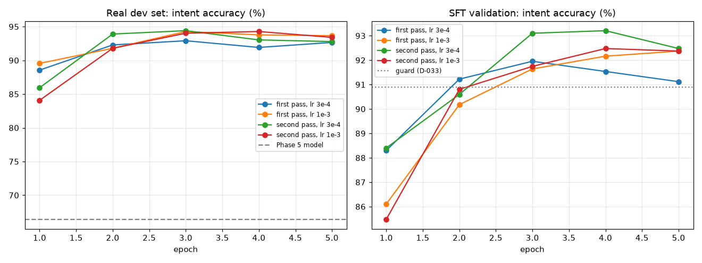

# Phase 5b results: real customer messages (D-033)

Generated on 2026-09-25 by `scripts/real_round_report.py`; do not edit by hand. Setup: D-033 in [DECISIONS.md](../DECISIONS.md). The human test set is not used here.

## Data

- Real messages (Banking77 and CLINC150 train splits, CC-BY): 5,391 mapped; 31 dropped as near copies of test messages; **804 held out as the real dev set**; 733 training candidates dropped as near copies of dev messages; 3,315 training candidates (at most 500 per intent).
- real-cc-by: added 2,921 (dropped: judge disagreed 213, broken reply 4, duplicate 134, near copy of a test or dev message 0).
- style-en: added 770 (dropped: judge disagreed 99, broken reply 10, duplicate 0, near copy of a test or dev message 10).
- Final data (final-v4): 24,263 training and 957 validation examples (the validation split is unchanged).

## Sweep and selection

| Run | Epoch | Real dev: intent acc. | Real dev: macro-F1 | Real dev: valid JSON | SFT val: intent acc. |
|---|---:|---:|---:|---:|---:|
| first pass, lr 3e-4 | 1 | 88.6% | 87.7% | 99.8% | 88.3% |
| first pass, lr 3e-4 | 2 | 92.3% | 92.1% | 99.9% | 91.2% |
| first pass, lr 3e-4 | 3 | 92.9% | 92.5% | 100.0% | 92.0% |
| first pass, lr 3e-4 | 4 | 91.9% | 91.6% | 100.0% | 91.5% |
| first pass, lr 3e-4 | 5 | 92.7% | 92.2% | 100.0% | 91.1% |
| first pass, lr 1e-3 | 1 | 89.6% | 88.6% | 100.0% | 86.1% |
| first pass, lr 1e-3 | 2 | 91.8% | 92.0% | 99.9% | 90.2% |
| first pass, lr 1e-3 | 3 | 94.3% | 94.5% | 100.0% | 91.6% |
| first pass, lr 1e-3 | 4 | 93.8% | 93.2% | 100.0% | 92.2% |
| first pass, lr 1e-3 | 5 | 93.7% | 93.0% | 100.0% | 92.4% |
| second pass, lr 3e-4 | 1 | 85.9% | 86.2% | 99.1% | 88.4% |
| second pass, lr 3e-4 | 2 | 93.9% | 93.6% | 100.0% | 90.6% |
| second pass, lr 3e-4 | 3 | 94.4% | 94.5% | 100.0% | 93.1% |
| second pass, lr 3e-4 | 4 | 93.0% | 92.4% | 100.0% | 93.2% |
| second pass, lr 3e-4 | 5 | 92.8% | 92.7% | 99.8% | 92.5% |
| second pass, lr 1e-3 | 1 | 84.1% | 83.2% | 99.6% | 85.5% |
| second pass, lr 1e-3 | 2 | 91.8% | 91.1% | 99.9% | 90.8% |
| second pass, lr 1e-3 | 3 | 94.0% | 93.9% | 99.9% | 91.7% |
| second pass, lr 1e-3 | 4 | 94.3% | 93.7% | 100.0% | 92.5% |
| second pass, lr 1e-3 | 5 | 93.4% | 93.2% | 100.0% | 92.4% |

- Phase 5 model on the same real dev set: 66.4% intent accuracy, 66.2% macro-F1.
- **Chosen:** second pass, lr 3e-4, epoch 3 (`artifacts/checkpoints/sft-r3-second-lr3e-4/epoch_3.pt`): real dev 94.4% (macro-F1 94.5%), SFT validation 93.1%.
- Coverage on the real dev set (the threshold for Phase 6): at confidence ≥ 0.592, the model answers 97.8% of the dev messages with 95.0% intent accuracy.

## Per intent on the real dev set

| Intent | Messages | Chosen model | Phase 5 model |
|---|---:|---:|---:|
| card_not_working | 156 | 147/156 | 88/156 |
| fees_and_charges | 128 | 121/128 | 101/128 |
| unrecognized_transaction | 117 | 106/117 | 44/117 |
| other | 113 | 111/113 | 107/113 |
| transfer_issue | 113 | 109/113 | 81/113 |
| loans_and_credit | 60 | 55/60 | 41/60 |
| balance_or_statement | 45 | 42/45 | 24/45 |
| account_access | 30 | 28/30 | 14/30 |
| lost_or_stolen_card | 27 | 26/27 | 25/27 |
| order_status | 15 | 14/15 | 9/15 |

Most frequent confusions of the chosen model (gold → predicted):

| Gold | Predicted | Count |
|---|---|---:|
| fees_and_charges | transfer_issue | 5 |
| unrecognized_transaction | fees_and_charges | 5 |
| balance_or_statement | other | 3 |
| card_not_working | transfer_issue | 2 |
| card_not_working | unrecognized_transaction | 2 |
| card_not_working | fees_and_charges | 2 |
| loans_and_credit | bill_inquiry | 2 |
| transfer_issue | balance_or_statement | 2 |
| transfer_issue | card_not_working | 2 |
| unrecognized_transaction | lost_or_stolen_card | 2 |
