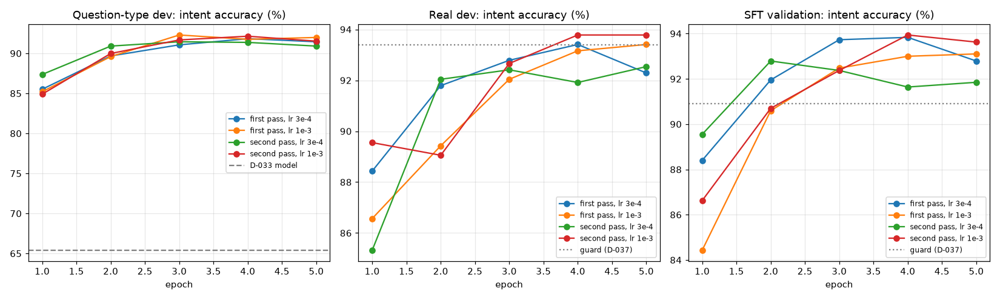

# Phase 5c results: question types the model had not seen (D-037)

Generated on 2026-09-25 by `scripts/qtype_round_report.py`; do not edit by hand. Setup: D-037 in [DECISIONS.md](../DECISIONS.md). The human test set is not used here.

## Data

- Bitext: 6,923 messages mapped; 1 dropped as near copies of test messages; **1,038 held out for the question-type dev set**; 2,676 training candidates dropped as near copies of dev messages; 2,877 training candidates.
- MASSIVE: 1,735 messages mapped; 1 dropped as near copies of test messages; **260 held out for the question-type dev set**; 36 training candidates dropped as near copies of dev messages; 1,193 training candidates.
- qt-bitext: added 2,508 (dropped: judge disagreed 301, broken reply 15, duplicate 1, near copy of a test or dev message 14).
- qt-massive: added 940 (dropped: judge disagreed 112, broken reply 13, duplicate 111, near copy of a test or dev message 5).
- qt-grid: added 4,204 (dropped: judge disagreed 853, broken reply 244, duplicate 3, near copy of a test or dev message 1).
- qt-grid2: added 2,387 (dropped: judge disagreed 583, broken reply 113, duplicate 3, near copy of a test or dev message 1).
- Final data (final-v5): 34,302 training and 957 validation examples (the validation split is unchanged).

## Sweep and selection

| Run | Epoch | Question-type dev | Real dev | SFT validation | Question-type dev: valid JSON |
|---|---:|---:|---:|---:|---:|
| first pass, lr 3e-4 | 1 | 85.5% | 88.4% | 88.4% | 100.0% |
| first pass, lr 3e-4 | 2 | 89.7% | 91.8% | 92.0% | 99.8% |
| first pass, lr 3e-4 | 3 | 91.1% | 92.8% | 93.7% | 99.8% |
| first pass, lr 3e-4 | 4 | 91.8% | 93.4% | 93.8% | 99.9% |
| first pass, lr 3e-4 | 5 | 91.4% | 92.3% | 92.8% | 99.8% |
| first pass, lr 1e-3 | 1 | 85.2% | 86.6% | 84.4% | 99.8% |
| first pass, lr 1e-3 | 2 | 89.6% | 89.4% | 90.6% | 100.0% |
| first pass, lr 1e-3 | 3 | 92.3% | 92.0% | 92.5% | 100.0% |
| first pass, lr 1e-3 | 4 | 91.8% | 93.2% | 93.0% | 99.9% |
| first pass, lr 1e-3 | 5 | 92.0% | 93.4% | 93.1% | 99.9% |
| second pass, lr 3e-4 | 1 | 87.4% | 85.3% | 89.6% | 99.8% |
| second pass, lr 3e-4 | 2 | 90.9% | 92.0% | 92.8% | 100.0% |
| second pass, lr 3e-4 | 3 | 91.4% | 92.4% | 92.4% | 100.0% |
| second pass, lr 3e-4 | 4 | 91.4% | 91.9% | 91.6% | 99.9% |
| second pass, lr 3e-4 | 5 | 90.9% | 92.5% | 91.8% | 99.8% |
| second pass, lr 1e-3 | 1 | 84.9% | 89.6% | 86.6% | 99.8% |
| second pass, lr 1e-3 | 2 | 90.0% | 89.1% | 90.7% | 100.0% |
| second pass, lr 1e-3 | 3 | 91.7% | 92.7% | 92.4% | 100.0% |
| second pass, lr 1e-3 | 4 | 92.1% | 93.8% | 93.9% | 100.0% |
| second pass, lr 1e-3 | 5 | 91.5% | 93.8% | 93.6% | 99.8% |

- The D-033 model on the same question-type dev set: 65.4% intent accuracy, 60.6% macro-F1; on the real dev set (D-033): 94.4%.
- **Chosen:** second pass, lr 1e-3, epoch 4 (`artifacts/checkpoints/sft-r4-second-lr1e-3/epoch_4.pt`): question-type dev 92.1% (macro-F1 89.2%), real dev 93.8%, SFT validation 93.9%.
- Coverage on the real dev set (the threshold for the test): at confidence ≥ 0.701, the model answers 97.3% of the real dev messages with 95.0% intent accuracy.

## Per intent on the question-type dev set

| Intent | Messages | Chosen model | D-033 model |
|---|---:|---:|---:|
| other | 315 | 296/315 | 236/315 |
| handoff_to_human | 135 | 132/135 | 85/135 |
| account_access | 90 | 88/90 | 69/90 |
| transfer_issue | 90 | 90/90 | 67/90 |
| order_status | 80 | 59/80 | 48/80 |
| balance_or_statement | 45 | 45/45 | 45/45 |
| bill_inquiry | 45 | 38/45 | 15/45 |
| card_not_working | 45 | 45/45 | 26/45 |
| change_delivery_details | 45 | 45/45 | 16/45 |
| fees_and_charges | 45 | 45/45 | 45/45 |
| loans_and_credit | 45 | 45/45 | 30/45 |
| lost_or_stolen_card | 45 | 44/45 | 16/45 |
| network_or_internet_issue | 45 | 43/45 | 19/45 |
| plan_change | 45 | 45/45 | 22/45 |
| refund_request | 45 | 44/45 | 32/45 |
| roaming | 45 | 44/45 | 45/45 |
| sim_or_number | 45 | 0/45 | 5/45 |
| unrecognized_transaction | 45 | 45/45 | 25/45 |
| cancel_order | 3 | 3/3 | 3/3 |

Most frequent confusions of the chosen model (gold → predicted):

| Gold | Predicted | Count |
|---|---|---:|
| sim_or_number | plan_change | 30 |
| order_status | other | 21 |
| sim_or_number | other | 10 |
| bill_inquiry | other | 4 |
| bill_inquiry | transfer_issue | 3 |
| handoff_to_human | other | 3 |
| other | lost_or_stolen_card | 3 |
| other | network_or_internet_issue | 3 |
| other | account_access | 2 |
| other | transfer_issue | 2 |

## Reply faithfulness (D-032 judge, the same development replies)

300 development messages (150 from each dev set, seeded) with a valid answer from both models, judged by Qwen with the D-032 prompt.

| | D-033 model | Chosen model |
|---|---:|---:|
| answers | 86.0% (258/300; 82–89%) | 93.3% (280/300; 90–96%) |
| polite clear | 90.7% (272/300; 87–93%) | 93.3% (280/300; 90–96%) |
| language | 100.0% (300/300; 99–100%) | 98.7% (296/300; 97–99%) |
| safe | 94.3% (283/300; 91–96%) | 96.7% (290/300; 94–98%) |
| **all four yes** | 79.0% (237/300; 74–83%) | 86.3% (259/300; 82–90%) |

- Replies judged good only for the chosen model: 46; only for the D-033 model: 24.
